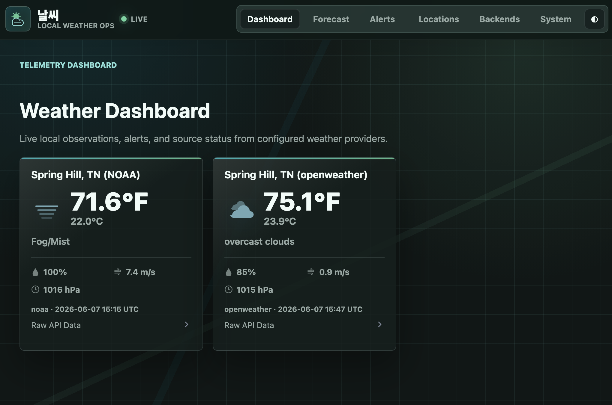
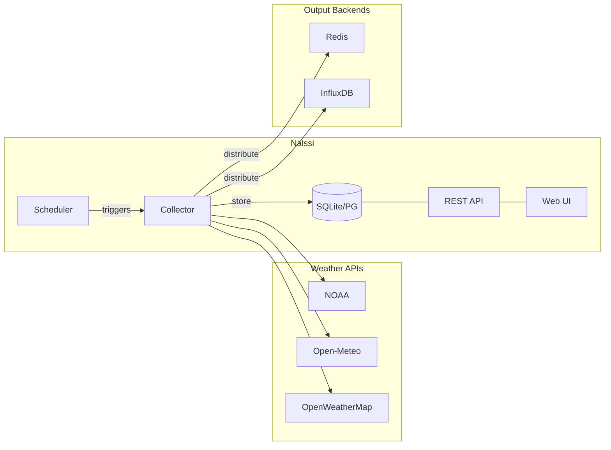

# Nalssi

[](https://github.com/swilcox/nalssi/actions/workflows/ci.yml)
[](https://codecov.io/gh/swilcox/nalssi)
[](https://github.com/swilcox/nalssi/actions/workflows/docker-publish.yml)
[](https://www.python.org/downloads/)
[](https://fastapi.tiangolo.com/)
[](https://docs.astral.sh/ruff/)
[](LICENSE)

Nalssi (날씨, Korean for "weather") is a centralized weather data collection and distribution service. It fetches weather data from multiple free APIs on a schedule, stores it locally, and distributes it to configurable output backends — so your other applications can consume weather data without each making their own API calls.



## How It Works



**Collector** runs on a configurable interval (default: 5 min), selects the right API per location (NOAA for US, Open-Meteo for international), normalizes responses into a common format, stores them, and pushes to any enabled output backends.

## Features

- **Multi-API support** — NOAA Weather.gov, Open-Meteo, OpenWeatherMap with automatic selection and fallback
- **Weather alerts** — Collects and stores warnings/watches with upsert deduplication
- **Output backends** — Redis (with pluggable format transforms) and InfluxDB, with more planned
- **REST API** — Full CRUD for locations, weather data, alerts, and backend configuration
- **Web UI** — HTMX-based dashboard for managing locations, backends, and viewing weather data
- **Scheduled collection** — Background APScheduler with per-location intervals
- **Docker ready** — Single `docker-compose up` to run everything

## Quick Start

```bash
# Clone and start with Docker
git clone https://github.com/swilcox/nalssi.git
cd nalssi
docker-compose up -d

# Or run locally with uv
uv sync
uv run alembic upgrade head
uv run uvicorn app.main:app --reload
```

The API and web UI will be available at `http://localhost:8000`.

## Supported Weather APIs

| API | Coverage | Cost | API Key Required |
|-----|----------|------|:---:|
| NOAA Weather.gov | US | Free | No |
| Open-Meteo | Global | Free (non-commercial) | No |
| OpenWeatherMap | Global | Free tier | Yes |

## API Documentation

Once running, visit:
- Interactive API docs: `http://localhost:8000/docs`
- Alternative API docs: `http://localhost:8000/redoc`

## Testing

```bash
uv run pytest                   # Run all tests
uv run pytest -m unit           # Unit tests only
uv run pytest -m integration    # Integration tests only
uv run pytest --no-cov -q       # Quick run without coverage
```

## Kurokku Alert Priorities

When writing alerts to a Redis backend using the `kurokku` format, each alert is assigned a numeric priority (0 = highest, 5 = lowest) that the kurokku LED clock uses to decide display order.

Priority is determined in this order:

1. **Event keyword match** — the alert's `event` text is matched case-insensitively against the table below. When multiple keywords match (e.g. `severe thunderstorm` and `severe thunderstorm watch`), the longest keyword wins so more specific entries beat more general ones regardless of config order.
2. **CAP severity fallback** — if no keyword matches, the alert's CAP `severity` field (from NOAA) maps to a priority.
3. **Urgency bump** — if the CAP fallback was used and `urgency` is `Immediate`, priority is bumped up by one level (minimum 0).
4. **Default** — priority 5 if nothing else matches.

**Event keyword mapping (defaults):**

| Priority | Events |
|---------:|--------|
| 0 | tornado, tsunami, extreme wind, hurricane, typhoon, storm surge |
| 1 | flash flood, severe thunderstorm, blizzard |
| 2 | flood, winter storm, high wind, ice storm, excessive heat, fire weather |
| 3 | wind chill, freeze, frost, cold weather advisory, heat advisory, wind advisory, dense fog |
| 4 | winter weather, special weather |

**Watches:** All Watch events (e.g. `severe thunderstorm watch`, `hurricane watch`, `flood watch`) are mapped to priority **3**, with one exception: `tornado watch` is priority **2** due to its short lead time and life-safety risk. Because the matcher prefers the longest matching keyword, Watch events resolve to these Watch-specific entries rather than inheriting their Warning's priority.

**CAP severity fallback (when no keyword matches):**

| CAP Severity | Priority |
|--------------|---------:|
| Extreme | 1 |
| Severe  | 2 |
| Moderate | 3 |
| Minor   | 4 |
| Unknown | 5 |

### Overriding priorities per backend

The default mapping can be overridden on a per-backend basis by setting `alert_priorities` in the backend's Format Config JSON:

```json
{
  "alert_priorities": {
    "tornado": 0,
    "my custom event": 1
  }
}
```

Matching is case-insensitive substring matching against the alert's event text. When overriding, the *entire* default table is replaced — include every keyword you want matched.

## Testing Kurokku Devices

The `scripts/fake_alerts.py` tool pushes fake weather alerts directly to a kurokku device's Redis instance, bypassing the normal collection pipeline. Useful for verifying alert display timing, priority ordering, and scrolling behavior on LED clocks.

```bash
# Push a single Tornado Warning (priority 0) with 5 min TTL
uv run python scripts/fake_alerts.py --scenario tornado --redis-url redis://lcdtest.local:6379

# Push multiple alerts at different priority levels
uv run python scripts/fake_alerts.py --scenario mixed --redis-url redis://192.168.1.100

# Shorter TTL for quick iteration (2 minutes)
uv run python scripts/fake_alerts.py --scenario severe --ttl 120 --redis-url redis://lcdtest.local:6379

# Preview what would be written without touching Redis
uv run python scripts/fake_alerts.py --scenario all --dry-run

# Custom alert text
uv run python scripts/fake_alerts.py --scenario custom --event "Zombie Apocalypse Warning" --priority 0 --redis-url redis://lcdtest.local:6379

# Clear all test alerts from a device
uv run python scripts/fake_alerts.py --clear --redis-url redis://lcdtest.local:6379
```

**Built-in scenarios:**

| Scenario | Alerts | Priorities |
|----------|--------|------------|
| `tornado` | Tornado Warning | 0 |
| `severe` | Severe Thunderstorm Warning | 1 |
| `flood` | Flash Flood Warning | 1 |
| `heat` | Excessive Heat Warning | 2 |
| `winter` | Winter Storm Warning | 2 |
| `wind` | High Wind Warning | 2 |
| `fog` | Dense Fog Advisory | 3 |
| `frost` | Frost Advisory | 3 |
| `mixed` | Tornado + Severe Tstorm + Heat | 0, 1, 2 |
| `all` | One of each priority level | 0–5 |
| `custom` | Your text via `--event` | Your value via `--priority` |

The `--slug` flag defaults to `spring_hill_tn_noaa`. Override it to target a different location's key namespace.

## Code Quality

```bash
uv run ruff check .             # Lint
uv run ruff format .            # Format
uv run mypy app tests           # Type check
```

### Pre-commit

```bash
uv run pre-commit install       # Install the local Git hook
uv run pre-commit run --all-files
```

## Configuration

Copy `.env.example` to `.env` and edit as needed. Key settings:

| Variable | Default | Description |
|----------|---------|-------------|
| `DATABASE_URL` | `sqlite:///./nalssi.db` | Database connection |
| `DEFAULT_COLLECTION_INTERVAL` | `300` | Seconds between collections |
| `ENABLE_SCHEDULER` | `true` | Enable/disable background collection |
| `OPENWEATHER_API_KEY` | | Required for OpenWeatherMap |
| `REDIS_URL` | | Redis backend connection |
| `INFLUXDB_URL` | | InfluxDB backend connection |

## Project Structure

```
nalssi/
├── app/
│   ├── api/routes/             # REST API + page routes
│   ├── models/                 # SQLAlchemy models
│   ├── schemas/                # Pydantic schemas
│   ├── services/
│   │   ├── collectors/         # Weather collection
│   │   ├── weather_apis/       # API clients (NOAA, Open-Meteo, OpenWeather)
│   │   ├── outputs/            # Output backends (Redis, InfluxDB)
│   │   ├── broadcast.py        # WebSocket connection manager
│   │   └── scheduler.py        # APScheduler setup
│   ├── templates/              # Jinja2 + HTMX templates
│   ├── config.py               # Pydantic settings
│   ├── database.py             # SQLAlchemy setup
│   └── main.py                 # FastAPI application
├── tests/
│   ├── unit/                   # Unit tests
│   ├── integration/            # Integration tests
│   └── fixtures/               # Test fixtures (API responses)
├── scripts/
│   └── fake_alerts.py          # Push fake alerts to kurokku devices
├── alembic.ini
├── docker-compose.yml
├── Dockerfile
├── Makefile
├── pyproject.toml
└── uv.lock
```

## Tech Stack

- **Python 3.11+** / **FastAPI** / **SQLAlchemy** / **Alembic**
- **APScheduler** for background collection
- **httpx** for async HTTP
- **Jinja2 + HTMX** for web UI with live WebSocket updates
- **Docker** for deployment
- **uv** for dependency management
- **ruff** for linting/formatting, **pytest** for testing

## License

MIT — see [LICENSE](LICENSE) for details.
