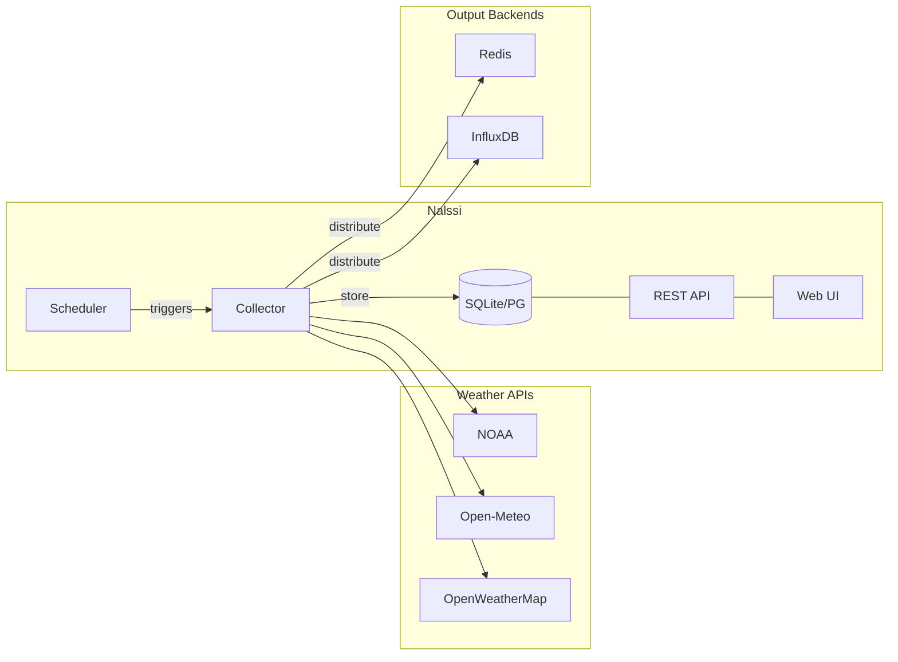

# Nalssi

Nalssi (날씨, Korean for "weather") is a centralized weather data collection and distribution service. It fetches weather data from multiple free APIs on a schedule, stores it locally, and distributes it to configurable output backends — so your other applications can consume weather data without each making their own API calls.

## How It Works



**Collector** runs on a configurable interval (default: 5 min), selects the right API per location (NOAA for US, Open-Meteo for international), normalizes responses into a common format, stores them, and pushes to any enabled output backends.

## Features

- **Multi-API support** — NOAA Weather.gov, Open-Meteo, OpenWeatherMap with automatic selection and fallback
- **Weather alerts** — Collects and stores warnings/watches with upsert deduplication
- **Output backends** — Redis (with pluggable format transforms) and InfluxDB, with more planned
- **REST API** — Full CRUD for locations, weather data, alerts, and backend configuration
- **Web UI** — HTMX-based dashboard for managing locations, backends, and viewing weather data
- **Scheduled collection** — Background APScheduler with per-location intervals
- **Docker ready** — Single `docker-compose up` to run everything

## Quick Start

```bash
# Clone and start with Docker
git clone https://github.com/swilcox/nalssi.git
cd nalssi
docker-compose up -d

# Or run locally with uv
cd backend
uv sync
uv run alembic upgrade head
uv run uvicorn app.main:app --reload
```

The API and web UI will be available at `http://localhost:8000`.

## Supported Weather APIs

| API | Coverage | Cost | API Key Required |
|-----|----------|------|:---:|
| NOAA Weather.gov | US | Free | No |
| Open-Meteo | Global | Free (non-commercial) | No |
| OpenWeatherMap | Global | Free tier | Yes |

## Documentation

- **[Backend documentation](backend/README.md)** — detailed architecture, API usage, configuration, and development guide

## Tech Stack

- **Python 3.11+** / **FastAPI** / **SQLAlchemy** / **Alembic**
- **APScheduler** for background collection
- **httpx** for async HTTP
- **Jinja2 + HTMX** for web UI
- **Docker** for deployment
- **uv** for dependency management
- **ruff** for linting/formatting, **pytest** for testing

## License

TBD
